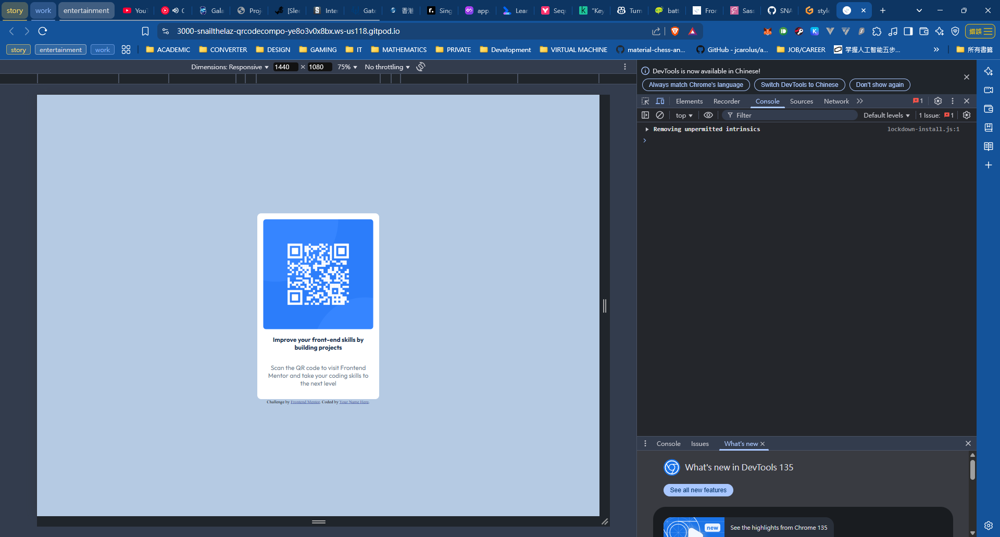
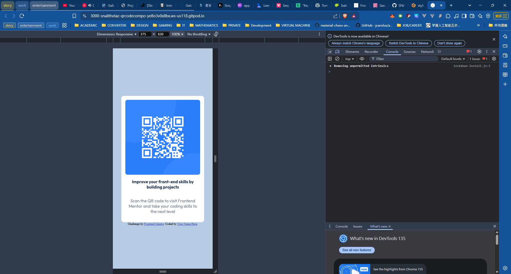

# Frontend Mentor - QR code component solution

This is a solution to the [QR code component challenge on Frontend Mentor](https://www.frontendmentor.io/challenges/qr-code-component-iux_sIO_H). Frontend Mentor challenges help you improve your coding skills by building realistic projects. 

## Table of contents

- [Overview](#overview)
  - [Screenshot](#screenshot)
  - [Links](#links)
- [My process](#my-process)
  - [Built with](#built-with)
  - [What I learned](#what-i-learned)
  - [Continued development](#continued-development)
  - [Useful resources](#useful-resources)
- [Author](#author)
- [Acknowledgments](#acknowledgments)

**Note: Delete this note and update the table of contents based on what sections you keep.**

## Overview

### Screenshot

Here is the desktop preview for the project using the developer console.

Here is the mobile preview for the project.

### Links

- Solution URL: [Add solution URL here](https://your-solution-url.com)
- Live Site URL: [Add live site URL here](https://your-live-site-url.com)

## My process

### Built with

- Semantic HTML5 markup
- CSS custom properties
- Flexbox
- sass
- [Gitpod](https://gitpod.io)


### What I learned

To recap css and use sass to style the page, like the units in css has 2 types: absolute and relative, for the styling in body tag, I used relative units `vh`, this represents the viewport height in ratio, and have a good use with `mixin` in sass for the project, which can easily group your code into small pieces.

```scss
// here are the mixins I used for the project, since they will be reuse many-times for the project.
@mixin text($weight:400,$color:white) {
    font-family: "Outfit", sans-serif;
    font-optical-sizing: auto;
    font-weight: $weight;
    font-style: normal;
    color:$color;
  }
  
@mixin flex-center($direction:column){
    display:flex;
    flex-direction: $direction;
    align-items: center;
    justify-content: center;
}

@mixin text-align($align:center){
    text-align: $align;
}
```

Also, how to style the images and let it fit to the requirement of the provided assets.
```scss
// ... here is what I used to keep the image fit with the content. it is referred from the w3schools and have a little tweak about it.
& img{
  border-radius:8px;
  width:100%;
  max-width: 100%;
  height: auto;
}
```

### Continued development
I am going to hone my styling skills with sass, which would be a good tools for my future projects

### Useful resources

- [Sass Official Documentation](https://sass-lang.com/documentation/)
- [css units](https://www.w3schools.com/cssref/css_units.php)
- [How to fit and style the image](https://www.w3schools.com/css/css3_images.asp)

## Author
- Frontend Mentor - [@SNAILTHELAZY](https://www.frontendmentor.io/profile/SNAILTHELAZY)
- Github - [SNAILTHELAZY](https://github.com/SNAILTHELAZY)

## Acknowledgments

This project is done mostly be myself, with the help from the stackoverflow for the positioning problem of the components. And the [Useful Resources](#useful-resources) listed above.
